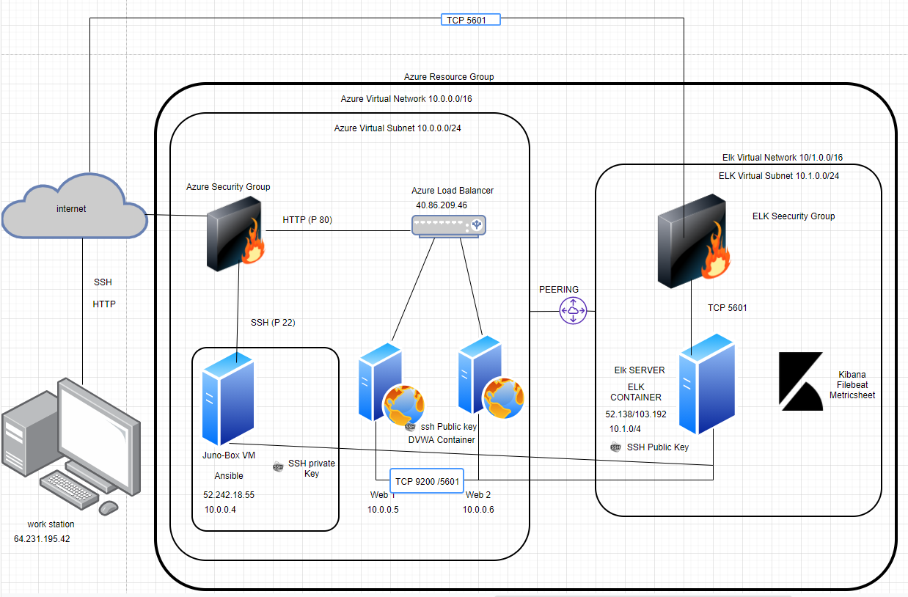
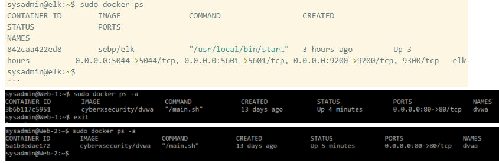

## Automated ELK Stack Deployment

The files in this repository were used to configure the network depicted below.



These files have been tested and used to generate a live ELK deployment on Azure. They can be used to either recreate the entire deployment pictured above. Alternatively, select portions of the _yml and configuration____ file may be used to install only certain pieces of it, such as Filebeat.

[Ansible Host](Files/Ansible_host.txt)

[Ansible Playbook](Files/Ansible_playbook.txt)

[Ansible Elk installatiom and Vm configuration](Files/Ansible_Elk_installatiom_and_Vm_configuration.txt)

[Ansible Filebeat Playbook](Files/Ansible_filebeat_Playbook.txt)

[File Beat Configuration File](Files/file_beat_configuration_file.txt)

[Ansible Metricbeat Playbook](Files/Ansible_metricbeat_playbook.txt)

[Ansible Metric Beat Configuration File](Files/Ansible_Metric_beat_configuration_file.txt)

[Ansible Configuration](Files/ansible_configuration.txt)


Download the ansible.cfg configuration file on this website https://ansible.com/ and edit or copy Ansible Configuration to your /etc/ansible directory

For ansible.cfg edit:

      cd /etc/ansible/	
      nano ansible.cfg
      CTRL + W > enter remote_user
      change `remote_user = sysadmin`

Assign username and SSH Public Key for Web1, Web2, ELK Virtual Machine in Azure GUI

Web1 / Web2 / ELK Server > Reset Password > Reset SSH Public Key

      username: sysadmin
      SSH Key : copy id_rsa.pub from the ansible control node in .ssh/ directory. 

To get the SSH Key run this command:

    ~/.ssh# ssh-keygen
    ~/.ssh# cat id_rsa.pub

  
This document contains the following details:

    Description of the Topology
    Access Policies
    ELK Configuration
        Beats in Use
        Machines Being Monitored

    How to Use the Ansible Build
=======


These files have been tested and used to generate a live ELK deployment on Azure. They can be used to either recreate the entire deployment pictured above. Alternatively, select portions of the _____ file may be used to install only certain pieces of it, such as Filebeat. - beat

Ansible
root@c1e0a059c0b0:~# nano my-playbook1.yml

Filebeat :
root@c1e0a059c0b0:/etc/ansible/roles# nano filebeat-playbook.yml

Metricbeat : 
root@c1e0a059c0b0:/etc/ansible/files# nano metricbeat-config.yml

This document contains the following details:
- Description of the Topologu
- Access Policies
- ELK Configuration
  - Beats in Use
  - Machines Being Monitored
- How to Use the Ansible Build


### Description of the Topology

The main purpose of this network is to expose a load-balanced and monitored instance of DVWA, the D*mn Vulnerable Web Application.

Load balancing ensures that the application will be highly available in addition to restricting traffic to the network. 


- What aspect of security do load balancers protect? 
  
  Answer: Availability, Web Security 

  What is the advantage of a jump box? 
 
  Answer: Automation, Security, Network Segmentation, 

Integrating an ELK server allows users to easily monitor the vulnerable VMs for changes to the data and system logs

=======
Load balancing ensures that the application will be highly _____, in addition to restricting _____ to the network. 
Answer : available ,traffic

- What aspect of security do load balancers protect? 
  Answer: Availability, Web Security 

  What is the advantage of a jump box? 
  Answer: Automation, Security, Network Segmentation, 

Integrating an ELK server allows users to easily monitor the vulnerable VMs for changes to the _____ and system _____.
- What does Filebeat watch for?_ Filebeat monitors the log files or locations that you specify, collects log events, and forwards them either to Elasticsearch or Logstash for indexing.

- What does Metricbeat record?_  Metricbeat takes the metrics and statistics that it collects and ships them to the output that you specify, such as Elasticsearch or Logstash.

The configuration details of each machine may be found below.

=======
_Note: Use the [Markdown Table Generator](http://www.tablesgenerator.com/markdown_tables) to add/remove values from the table_.

| Name                 | Function     | IP Address               | Operating System |
|----------------------|----------    |--------------------------|------------------|
| Jump-Box-Provisioner | Gateway      | 10.0.0.4 /52.242.18.55   | Linux            |
| Web1                 |Web Server    | 10.0.0.5                 | Linux            |
| Web2                 |Web Server    | 10.0.0.6                 | Linux            |
| ACME-VM1             |ELK Server    | 10.1.0.4 /52.138.103.192 | Linux            |
| Load Balancer        |Load Balancer | Static  IP               | Linux            |
| Workstation          |Access Control| External IP              | Linux            |

Follow this step below to create a Load Balancer for Web1 and Web2

[1. Create a Load Balancer](File2/create_a_loadbalancer.PNG)

[2. Create Virtual Machine Web1](File2/create_virtual_machine_web1.PNG)

[3. Create Virtual Machine Web2](File2/create_virtual_machine_web2.PNG)

[4. Create Loadbalancer Back End Pool and Add Web1 and Web2 Virtual Machines](File2/create_loadbalancer_back_end_pool_and_add_web1_and_web2_virtual_machines.PNG)

[5. Create_a_load_balancing_rule](File2/Create_a_load_balancing_rule.PNG)

[6. Allow the AzureLoadBalacer Service in Security Group within the Virtual Network](File2/Allow_the_AzureLoadBalacer_Service_in_Security_Group_within_the_Virtual_Network.PNG)


Follow this step to test the instances of the redundancy for Web1 and Web2 Virtual Machine.

1. Verify that the DVWA site is up and running and can be accessed from the web.
    
    Go to your Chrome browser and type http://[Load-Balancer-External-IP]/setup.php

    See this image if successful : DVWA Redundancy Test
2. Turn off one of your VMs (Web1 or Web2) from the Azure portal. Confirm if you can still access the DVWA website.
3. Finally turning off both VMs making sure there are no access. See image
=======
| Load Balancer        |Load Balancer | Dynamic IP               | Linux            |
| Workstation          |Access Control| 64.231.21.12             | Linux            |


### Access Policies

The machines on the internal network are not exposed to the public Internet. 

Only the Elk Server machine can accept connections from the Internet. Access to this machine is only allowed from the following IP addresses:


- Jump-Box-Provisioner IP: 10.0.0.4 via ssh port 22

- Workstation public IP via port TCP 5601
=======
Only the _____ machine can accept connections from the Internet. Access to this machine is only allowed from the following IP addresses:
- _TODO: Add whitelisted IP addresses_

Machines within the network can only be accessed by _____.
- _TODO: Which machine did you allow to access your ELK VM? What was its IP address?_

A summary of the access policies in place can be found in the table below.

| Name     | Publicly Accessible  | Allowed IP Addresses              |
|----------|----------------------|-----------------------------------|
| Jump Box |      No              | MyPublicIPAddress on SSH 22       |
|   Web1   |      No              |   10.0.0.4 on SSH 22              |
|   Web2   |      No              |   10.0.0.4 on SSH 22              |
|ELK Server|      No              | MyPublicIPAddress using Port 5601 | 

### Elk Configuration

Ansible was used to automate configuration of the ELK machine. No configuration was performed manually, which is advantageous because Ansible lets you quickly and easily deploy multitier apps. You won't need to write custom code to automate your systems; you list the tasks required to be done by writing a playbook, and Ansible will figure out how to get your systems to the state you want them to be in.

The playbook implements the following tasks:

- Specify a different group of machines as well as a different remote user

      - name: Config elk VM with Docker
        hosts: elk
        remote_user: sysadmin
        become: true
        tasks:

- Increase System Memory :
    
      - name: Use more memory
        sysctl:
        name: vm.max_map_count
        value: '262144'
        state: present
        reload: yes

- Install the following services:
  
        `docker.io`
        `python3-pip`
        `docker`, which is the Docker Python pip module.

- Launching and Exposing the container with these published ports:

        `5601:5601` 
        `9200:9200`
        `5044:5044`

The following screenshot displays the result of running `docker ps` after successfully configuring the ELK instance.




### Target Machines & Beats
This ELK server is configured to monitor the following machines:

- Web1 : 10.0.0.5

- Web2 : 10.0.0.6

We have installed the following Beats on these machines:

- ELK Server, Web1 and Web2

- The ELK Stack Installed are: FileBeat and MetricBeat

These Beats allow us to collect the following information from each machine:

- Filebeat: log events

- Metricbeat: metrics and system statistics

### Using the Playbook
In order to use the playbook, you will need to have an Ansible control node already configured. Assuming you have such a control node provisioned:

SSH into the control node and follow the steps below:

For ELK VM Configuration:

- Copy the Ansible ELK Installation and VM Configuration

- Run the playbook using this command : ansible-playbook install-elk.yml

For FILEBEAT:

- Download Filebeat playbook usng this command:

  - curl -L -O https://gist.githubusercontent.com/slape/5cc350109583af6cbe577bbcc0710c93/raw/eca603b72586fbe148c11f9c87bf96a63cb25760/Filebeat > /etc/ansible/files/filebeat-config.yml

- Copy the '/etc/ansible/files/filebeat-config.yml' file to '/etc/filebeat/filebeat-playbook.yml'

- Update the filebeat-playbook.yml file to include installer

  - curl -L -O https://artifacts.elastic.co/downloads/beats/filebeat/filebeat-7.6.1-amd64.deb

- Update the filebeat-config.yml file root@c1e0a059c0b0:/etc/ansible/files# nano filebeat-config.yml

output.elasticsearch:


      #Array of hosts to connect to.
      hosts: ["10.1.0.4:9200"]
      username: "elastic"
      password: "changeme” 


          setup.kibana:
          host: "10.1.0.4:5601"

Run the playbook using this command ansible-playbook filebeat-playbook.yml and navigate to Kibana > Logs : Add log data > System logs > 5:Module Status > Check data to check that the installation worked as expected.


For METRICBEAT:

- Download Metricbeat playbook using this command:
``- curl -L -O https://gist.githubusercontent.com/slape/58541585cc1886d2e26cd8be557ce04c/raw/0ce2c7e744c54513616966affb5e9d96f5e12f73/metricbeat > /etc/ansible/files/metricbeat-config.yml

- Copy the /etc/ansible/files/metricbeat file to /etc/metricbeat/metricbeat-playbook.yml

- Update the filebeat-playbook.yml file to include installer
    - curl -L -O https://artifacts.elastic.co/downloads/beats/metricbeat/metricbeat-7.6.1-amd64.deb

- Update the metricbeat file rename to metricbeat-config.yml

root@c1e0a059c0b0:/etc/ansible/files# nano metricbeat-config.yml

    output.elasticsearch:
    #Array of hosts to connect to.
    hosts: ["10.1.0.4:9200"]
      username: "elastic"
      password: "changeme"

    setup.kibana:
      host: "10.1.0.4:5601"

- Run the playbook, (ansible-playbook metricbeat-playbook.yml) and navigate to Kibana > Add Metric Data > Docker Metrics > Module Status to check that the installation worked as expected


ADDITONAL NOTES:


How to get Filebeat installer :

- Login to Kibana > Logs : Add log data > System logs > DEB > Getting started

- Copy: curl -L -O https://artifacts.elastic.co/downloads/beats/filebeat/filebeat-7.6.1-amd64.deb


How to get the Metricbeat installer:

- Login to Kibana > Add Metric Data > Docker Metrics > DEB > Getting Started

- Copy: curl -L -O https://artifacts.elastic.co/downloads/beats/metricbeat/metricbeat-7.6.1-amd64.deb

Which file is the playbook? Where do you copy it?

- Answer : For the ANSIBLE : We will create the my-playbook1.yml as our playbook.

See the final solution of the Ansible Playbook

- Answer : For FILEBEAT: We will create filbeat-playbook.yml as our playbook.

See the final solution of the Filebeat Playbook

- Answer: For METRICBEAT: We will create metricbeat-playbook.yml as our playbook.

See the final solution of the Metricbeat Playbook

- Which file do you update to make Ansible run the playbook on a specific machine? How do I specify which machine to install the ELK server on versus which to install Filebeat on?

How to Download and Edit the Ansible Configuration file

    - root@c1e0a059c0b0:/etc/ansible# curl -L -O https://ansible.com/  > ansible.cfg

    - root@c1e0a059c0b0:/etc/ansible# nano ansible.cfg

    - Press CTRL + W (to search > enter remote_user then change `remote_user = sysadmin`
    Where : `sysadmin` is the remote user that has control over ansible.

How to Edit the Ansible Hosts file in this directory /etc/ansible/hosts

      #List the IP Addresses of your webservers
      #You should have at least 2 IP addresses

      [webservers]
      10.0.0.4 ansible_python_interpreter=/usr/bin/python3
      10.0.0.5 ansible_python_interpreter=/usr/bin/python3
      10.0.0.6 ansible_python_interpreter=/usr/bin/python3

      #List the IP address of your ELK server
      #There should only be one IP address
      [elk]
      10.1.0.4 ansible_python_interpreter=/usr/bin/python3

      Where: [webservers] and [elk] are the group of machines and each group has 1 or more members.

How to Create the ELK Installation and VM Configuration in the /etc/ansible/ directory:

See the final solution of the Ansible ELK Installation and VM Configuration

- Specify a different group of machines as well as a different remote user
            - name: Config elk VM with Docker
              hosts: elk
              remote_user: sysadmin
              become: true
              tasks:

    Where: [elk] is the Virtual Machine hosts or the group of machine targetted for this installation and can only be done by a `sysadmin` remote_user

How to Copy the raw Filebeat Module Configuration file from web to the /etc/ansible/files directory:


    - `curl -L -O https://gist.githubusercontent.com/slape/5cc350109583af6cbe577bbcc0710c93/raw/eca603b72586fbe148c11f9c87bf96a63cb25760/Filebeat > /etc/ansible/files/filebeat-config.yml'
      
      - Note : The filebeat-config.yml as our filebeat configuration file.

See the final solution of the Filebeat Config file

      hosts: ["10.1.0.4:9200"]
        username: "elastic"
        password: "changeme" 

      setup.kibana:
        host: "10.1.0.4:5601"
      Where: hosts: ["10.1.0.4:9200"] is the ELK VM that can install Filebeat

How to Copy the raw Metricbeat Module Configuration from web to the /etc/ansible/files/ directory:


`curl -L -O https://gist.githubusercontent.com/slape/58541585cc1886d2e26cd8be557ce04c/raw/0ce2c7e744c54513616966affb5e9d96f5e12f73/metricbeat > /etc/ansible/files/metricbeat-config.yml'

    Note : the metricbeat-config.yml as our metricbeat configuration file. ```

See the final solution of the Metricbeat Config file

    hosts: ["10.1.0.4:9200"]
      username: "elastic"
      password: "changeme" 

    setup.kibana:
      host: "10.1.0.4:5601"
    Where: hosts: ["10.1.0.4:9200"] is the ELK VM that can install Metricbeat

Which URL do you navigate to in order to check that the ELK server is running?

  - Test Kibana on web : http://[your.ELK-VM.External.IP]:5601/app/kibana

  - Test Kibana on localhost: sysadmin@10.1.0.4: curl localhost:5601/app/kibana


=======
| Jump Box |      No              | MyPublicIPAddress                 |
|   Web1   |      Yes             |   Any on Port 80                  |
|   Web2   |      Yes             |   Any on Port 80                  |
| ACME-VM1 |      No              | MyPublicIPAddress using Port 5601 | 

### Elk Configuration

Ansible was used to automate configuration of the ELK machine. No configuration was performed manually, which is advantageous because...
- _TODO: What is the main advantage of automating configuration with Ansible?_
Answer : Easy 1 file configuration to be deployed to multiple machines at the same time. 

The playbook implements the following tasks:
- _TODO: In 3-5 bullets, explain the steps of the ELK installation play. E.g., install Docker; download image; etc._
    -  Allow remote user
    -  Install Docker
    -  Install pip3
    -  Start Docker Module
    - 

The following screenshot displays the result of running `docker ps` after successfully configuring the ELK instance.


### Target Machines & Beats
This ELK server is configured to monitor the following machines: Web1 and Web2
- _TODO: List the IP addresses of the machines you are monitoring_
Web1 : 10.0.0.5
Web2 : 10.0.0.6

We have installed the following Beats on these machines: ELK Server
- _TODO: Specify which Beats you successfully installed_
FileBeat
MetricBeat

These Beats allow us to collect the following information from each machine:
- _TODO: In 1-2 sentences, explain what kind of data each beat collects, and provide 1 example of what you expect to see. E.g., `Winlogbeat` collects Windows logs, which we use to track user logon events, etc._
Filebeat -    monitors the log files or locations that you specify, collects log events, and forwards them either to   
              Elasticsearch or Logstash for indexing.
Metricbeat -  takes the metrics and statistics that it collects and ships them to the output that you specify, such as  
              Elasticsearch or Logstash.

### Using the Playbook
In order to use the playbook, you will need to have an Ansible control node already configured. Assuming you have such a control node provisioned: 

SSH into the control node and follow the steps below:
- Copy the  /etc/ansible/files/filebeat-config.yml file to  /etc/filebeat/filebeat.yml
- Update the _____ file to include... Answer : configuration, hosts, username, password
- Run the playbook, and navigate to ____ to check that the installation worked as expected. localhost or ELK Server

_TODO: Answer the following questions to fill in the blanks:_
- _Which file is the playbook? Where do you copy it? yml /etc/ansible
- _Which file do you update to make Ansible run the playbook on a specific machine? How do I specify which machine to install the ELK server on versus which to install Filebeat on? config file yml
- _Which URL do you navigate to in order to check that the ELK server is running? http://[your.ELK-VM.External.IP]:5601/app/kibana


_As a **Bonus**, provide the specific commands the user will need to run to download the playbook, update the files, etc._
root#: ansible-playbook playbook.yml
